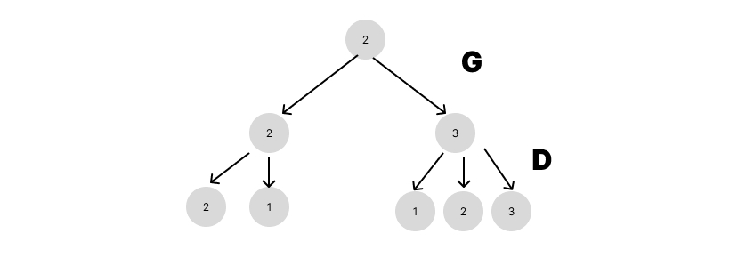

# PROBLEM OF THE WEEK

Question 1

solution:

the question requires us to find the probability of two players (Gukesh - G for short and Ding -D for short )  winning in a chess match given their initial state to be any of the 5 possibility

First, we simplified the problem by only assuming 3 possibilities

1 - G winning

2- Draw

3- Ding winning

with the following table

 

| G | 1 | 2 | 3 |
| --- | --- | --- | --- |
| 1 | 97 | 2 | 1 |
| 2 | 0 | 98 | 2 |
| 3 | 0 | 0 | 100 |

| D | 1 | 2 | 3 |
| --- | --- | --- | --- |
| 1 | 100 | 0 | 0 |
| 2 | 2 | 98 | 0 |
| 3 | 1 | 3 | 96 |

let P(x , y) denote the probability of  x (x = 1,2,3) outcome occurring at the step y (y = 1,2,3…..,20) 



The above represents the flow chart of the game for 1 move

P(1,1) = 98/100 * 2/100 + 2/100*3/100

the above expression is similar to the element of matrix multiplication when multiplying both the matrix. This led us to think the following problem could solved using matrix multiplication 

let i be the old position and j be the new position after one step then P(j,y) is the (i,j) element of the resultant matrix

Now coming back to the problem, let us assume a row matrix (A) which represents the probability of all the states at any given step

therefore the initial value of A is [0,1,0] This is because the initial state is given to be state 2 (draw)

now multiplying A with G gives us the probability of all the states after 1 move of G and again multiplying the resultant with D gives us the probability after 1 move of D. doing this 10 times gives us the final probability.

i.e, pseudo-code 

A = A*G

A = A*D

```python
import numpy as np

G = [[0.90,0.04,0.03,0.02,0.01],
     [0,0.91,0.04,0.03,0.02],
     [0,0,0.93,0.04,0.03],
     [0,0,0,0.95,0.05],
     [0,0,0,0,1]]

D = [[1,0,0,0,0],
     [0.08,0.92,0,0,0],
     [0.03,0.07,0.9,0,0],
     [0.02,0.03,0.07,0.88,0],
     [0.01,0.03,0.04,0.06,0.86]]

r = np.dot(G,D)

A = [0,0,1,0,0]

for i in range(10):
    A = np.dot(A,r)

winProb = (A[0]*0.9 + A[1]*0.7)*100
lossProb = (A[3]*0.6 + A[4]*0.8)*100
drawProb = (100-(winProb+lossProb))

print(drawProb)
print(winProb)
print(lossProb)
```

**Win probability =  34.03%**

**Draw probability = 46.97%**

**Loss probability = 19.00%**